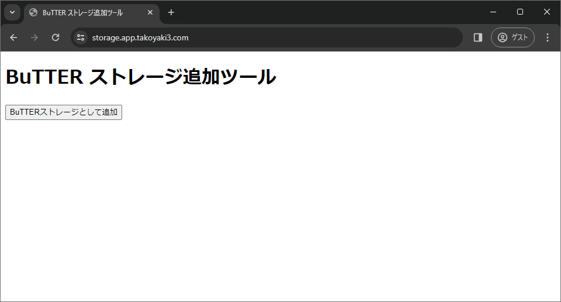
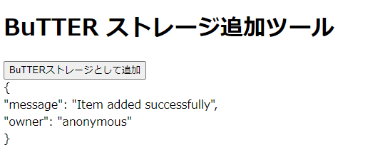

# BuTTERストレージホスト方法

## docker-composeによるホスト（SSL化環境が既に存在する場合）

### 前提条件
- DockerとDocker Composeがインストールされている。
- 使用するドメイン名が決定しており、DNS設定でこのサーバーを指している。
- 起動したコンテナに対する通信をSSL化できるリバースプロキシ等が存在する。

### ホスト手順

#### 1. サービスのデプロイ

1. ターミナルを開き、`storage`ディレクトリに移動します。

2. 次のコマンドにより、すべてのサービスを起動します。

```sh
docker-compose up -d
```

3. 起動したコンテナのポート（初期設定は8000）に対してHTTPSアクセスできるよう設定する

Caddy、NgineやApacheなどを間に挟み、HTTPSによりアクセスできるようにします。

4. 公開したURLにアクセスし、ストレージとして登録ボタンを押す



下のようなメッセージが表示されれば追加成功です。



5. 5分ほど待機する

5分ほど待機した後に[https://butter.takoyaki3.com/v0.0.0/root.json](https://butter.takoyaki3.com/v0.0.0/root.json)にアクセスしてROOTファイルを確認すると、ストレージが追加されたか確認できます。

```json
{
  "pub_keys": [
    {
      "pubkey": "https://pub-ad1f4a48b8ef46779b720e734b0c2e1d.r2.dev/public_key.pem"
    }
  ],
  "hosts": [
    "https://storage.app.takoyaki3.com",
    "https://butter.oozora283.com"
  ],
  "original_data": {
    "host": "https://pub-ad1f4a48b8ef46779b720e734b0c2e1d.r2.dev/v0.0.0/originalData/"
  },
  "api_endpoints": [
    "https://butter.hatano-yuuta7921.workers.dev/"
  ],
  "api_data_hosts": [
    "https://storage.app.takoyaki3.com/"
  ],
  "last_update": "2023-05-06T19_02_00+09_00"
}
```

## docker-composeによるホスト（SSL化環境がない場合）

### 前提条件
- DockerとDocker Composeがインストールされている。
- 使用するドメイン名が決定しており、DNS設定でこのサーバーを指している。

### ホスト手順

#### 1. Caddyファイルの作成

`storage`ディレクトリに含まれる`Caddyfile`を以下の内容に書き換えます。your-domain.comは使用するドメインに置き換えてください。

```
your-domain.com {
  reverse_proxy file-server:8000
}
```

#### 2. docker-compose.ymlの修正

次のように`docker-compose.yml`のCaddyに関するコメントアウトを解除します。

```yml
version: '3.8'
services:
  file-server:
    image: golang:1.19
    volumes:
      - ./:/app
    working_dir: /app
    command: go run fileServer.go
    ports:
      - "8000:8000"
    restart: unless-stopped

  data-updater:
    image: golang:1.19
    volumes:
      - ./:/app
    working_dir: /app
    command: go run dataUpdater.go
    restart: unless-stopped

  server-updater:
    image: golang:1.19
    volumes:
      - ./:/app
    working_dir: /app
    command: go run serverUpdater.go
    restart: unless-stopped

   caddy:
     image: caddy:2
     volumes:
       - ./Caddyfile:/etc/caddy/Caddyfile
       - caddy_data:/data
       - caddy_config:/config
     ports:
       - "80:80"
       - "443:443"
     restart: unless-stopped
 volumes:
   caddy_data:
   caddy_config:
```

#### 3. サービスのデプロイ

1. ターミナルを開き、`storage`ディレクトリに移動します。

2. 次のコマンドにより、すべてのサービスを起動します。

```sh
docker-compose up -d
```

このコマンドは、背後でDockerコンテナをビルドし、起動します。Caddyは自動的にLet's EncryptからSSL証明書を取得し、設定したドメインでHTTPS接続を提供します。

3. 公開したURLにアクセスし、ストレージとして登録ボタンを押す


4. 5分ほど待機する

5分ほど待機した後に[https://butter.takoyaki3.com/v0.0.0/root.json](https://butter.takoyaki3.com/v0.0.0/root.json)にアクセスしてROOTファイルを確認すると、ストレージが追加されたか確認できます。

```json
{
  "pub_keys": [
    {
      "pubkey": "https://pub-ad1f4a48b8ef46779b720e734b0c2e1d.r2.dev/public_key.pem"
    }
  ],
  "hosts": [
    "https://storage.app.takoyaki3.com",
    "https://butter.oozora283.com"
  ],
  "original_data": {
    "host": "https://pub-ad1f4a48b8ef46779b720e734b0c2e1d.r2.dev/v0.0.0/originalData/"
  },
  "api_endpoints": [
    "https://butter.hatano-yuuta7921.workers.dev/"
  ],
  "api_data_hosts": [
    "https://storage.app.takoyaki3.com/"
  ],
  "last_update": "2023-05-06T19_02_00+09_00"
}
```

## 注意事項
- SSL証明書の取得には、インターネットからのアクセスが必要です。
- DNS設定が正しく行われていることを確認してください。
- この設定を使用することで、提供されたサービスにHTTPS経由で安全にアクセスできるようになります。

